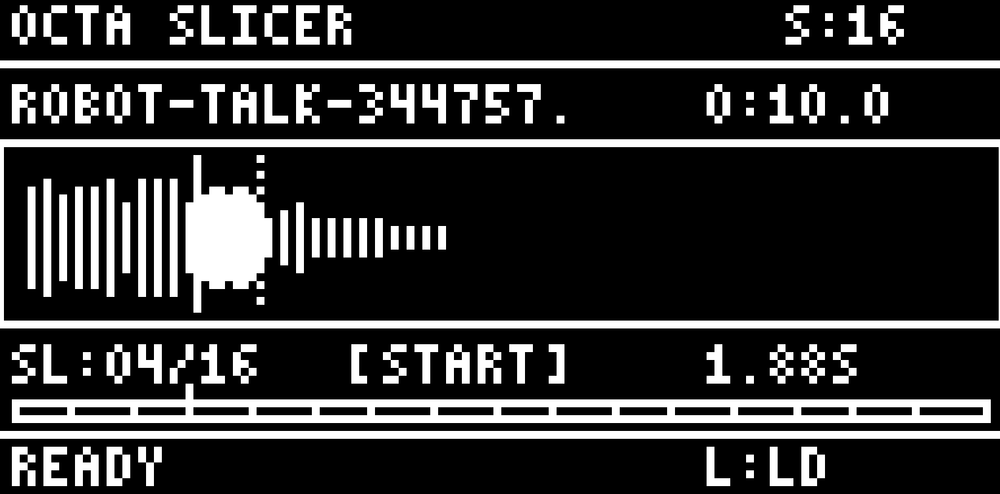

# OCTA SLICER




I needed a way to prep longer samples from songs or audio clips into smaller files before loading them onto the Octatrack. Got tired of resampling or manually creating new slices every time I wanted to chop something up. So I made this little tool that lets you visually slice a long sample into however many parts you want (8, 16, 32, etc), preview each slice, adjust the start/end points, and export them all as separate Octatrack-ready WAV files. Batch loading works too if you've got a bunch of files to process. Everything exports as 16-bit/44.1kHz mono so it's good to go straight onto the OT.

## Installation

```bash
# Clone the repository
git clone https://github.com/yourusername/octa-sample-prep.git
cd octa-sample-prep

# Install dependencies
pip install -r requirements.txt

# Run the application
python octa_slicer.py
```

### Dependencies

**Required:**
- `numpy` - Audio data processing

**Recommended:**
- `soundfile` - Load various audio formats (WAV, AIFF, FLAC, MP3, OGG)
- `scipy` - High-quality resampling
- `sounddevice` - Audio playback

Without optional dependencies, only WAV files are supported and playback uses macOS `afplay`.

## Keyboard Controls

| Key | Action |
|-----|--------|
| `L` | Load audio file |
| `B` | Batch load multiple files |
| `O` | Set output directory |
| `S` | Cycle slice count (4/8/16/32/64) |
| `Space` | Play current slice |
| `+` / `=` | Move slice position right |
| `-` / `_` | Move slice position left |
| `Shift + +/-` | Move position (10x faster) |
| `Up` / `Down` | Select previous/next slice |
| `Left` / `Right` | Toggle editing start/end point |
| `Enter` | Process and export slices |
| `Q` / `Esc` | Quit |

## Output Format

All exported slices are automatically converted to Octatrack-compatible format:

- **Format:** WAV (PCM)
- **Bit Depth:** 16-bit
- **Sample Rate:** 44,100 Hz
- **Channels:** Mono

### File Naming

Output files are named: `[original-filename]-[slice-number].wav`

Example: `drums.wav` sliced into 16 parts becomes:
```
drums-1.wav
drums-2.wav
...
drums-16.wav
```

## Usage Example

1. Press `L` to load an audio file
2. Press `S` to select the number of slices (default: 16)
3. Use `Up`/`Down` to navigate between slices
4. Use `+`/`-` to adjust slice start/end positions
5. Press `Left`/`Right` to toggle between editing start or end
6. Press `Space` to preview the current slice
7. Press `O` to set output directory (default: `~/Desktop/OctaSlices`)
8. Press `Enter` to export all slices

## Batch Processing

1. Press `B` to select multiple audio files
2. Edit slices for the first file
3. Press `Enter` to export - automatically advances to next file
4. Repeat until all files are processed

## Technical Details

### Display Simulation

The application simulates the Octatrack's 128x64 pixel backlit LCD:
- Each "pixel" is rendered as a 6x6 screen pixel block
- Custom 5x7 and 3x5 bitmap fonts for text
- Monochrome white-on-black display

### Audio Processing

- Automatic resampling from any sample rate to 44.1kHz
- Normalization of clipping audio
- Validation of exported WAV files

## License

MIT License - See [LICENSE](LICENSE) for details.

## Acknowledgments

- Inspired by the [Elektron Octatrack](https://www.elektron.se/products/octatrack-mkii/)
- Based on patterns from [auto-slicer](https://github.com/simon-off/auto-slicer) and [audio-slicer](https://github.com/openvpi/audio-slicer)
